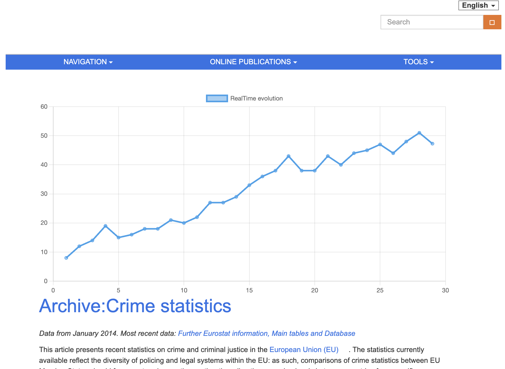
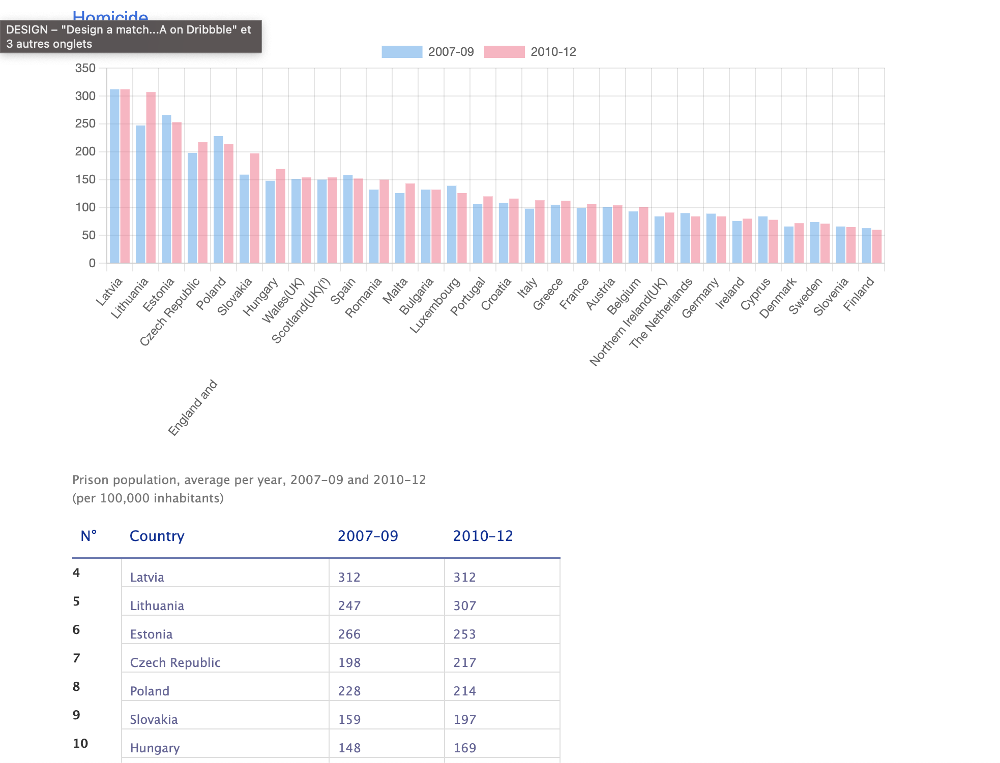

# Data Visualisation

Intégration de graphiques sur base de données récupérée dans un tableau html et récupérations de données en direct pour les intégrée à un graphique dynamique et actualisé en temps réel.

## Live version

See it live [HERE](https://bschutters.github.io/vcard-react)

## Preview

## Stack Technique

- HTML
- CSS
- Vanilla JS
- Chart.js

